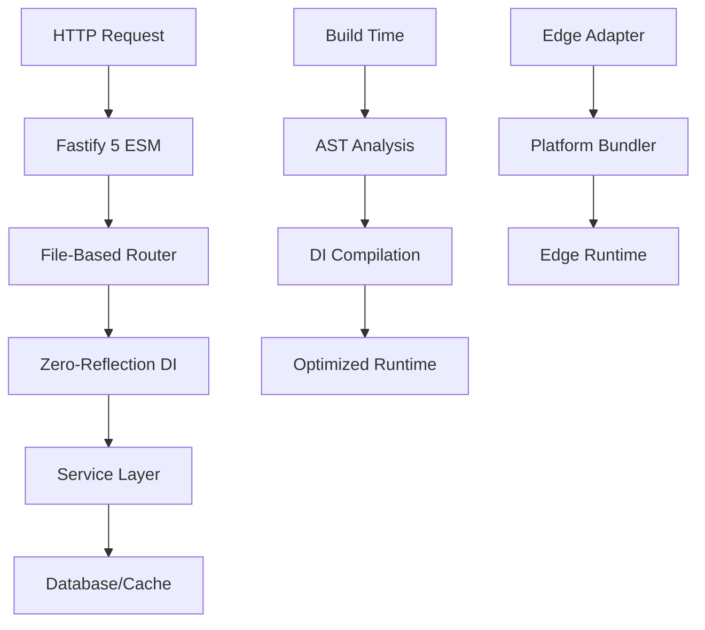

<h1 align="center">Pulzar Framework Organization</h1>

<div align="center">


# 🚀 Next-Generation TypeScript Framework

### **Ultra-Fast • Edge-First • Zero-Reflection • Production-Ready**

[](https://github.com/pulzar/pulzar)
[](https://www.npmjs.com/package/@pulzar/core)
[](https://www.npmjs.com/package/@pulzar/core)
[](https://opensource.org/licenses/MIT)

[](https://www.typescriptlang.org/)
[](https://fastify.dev/)
[](https://workers.cloudflare.com/)
[](https://github.com/pulzar/pulzar#performance)

---

### **Building the future of web applications with blazing performance and developer experience**

[🚀 Get Started](#-quick-start) • [📖 Documentation](https://pulzar.dev) • [💬 Community](https://discord.gg/pulzar) • [🎯 Examples](https://github.com/pulzar/examples)

</div>

---

## 🌟 **Why Pulzar?**

<table>
<tr>
<td width="50%">

---

## �� **Performance Benchmarks**

<div align="center">

| Framework  | Requests/sec | Latency (p99) | Memory Usage | Bundle Size |
| ---------- | ------------ | ------------- | ------------ | ----------- |
| Express    | ~25,000      | ~45ms         | ~85MB        | ~15MB       |
| Fastify    | ~65,000      | ~18ms         | ~45MB        | ~8MB        |
| **Pulzar** | **~75,000+** | **~12ms**     | **~28MB**    | **~5MB**    |

_Benchmark results on Node.js 18+ with production builds_

</div>

---

## 🚀 **Quick Start**

```bash
# Create new project
npx @pulzar/cli new my-app
cd my-app

# Start development
npm run dev
```

### **Your First API Route**

```typescript
// src/routes/hello.get.ts
import { createRoute } from "@pulzar/core";
import { z } from "zod";

const QuerySchema = z.object({
  name: z.string().default("World"),
});

export default createRoute({
  query: QuerySchema,
  handler: async ({ query }) => {
    return {
      message: `Hello, ${query.name}!`,
      timestamp: new Date().toISOString(),
    };
  },
});
```

### **Zero-Reflection Dependency Injection**

```typescript
// src/services/user.service.ts
@Injectable()
export class UserService {
  constructor(
    private readonly db: DatabaseService,
    private readonly cache: CacheService
  ) {}

  async getUser(id: string) {
    return this.cache.remember(`user:${id}`, () => this.db.findById(id));
  }
}

// Auto-compiled at build time - no runtime reflection!
```

---

## 🏗️ **Framework Architecture**

<div align="center">



</div>

---

## 🎯 **Core Repositories**

<div align="center">

| Repository                                             | Description               | Status                                                                                                                                                         |
| ------------------------------------------------------ | ------------------------- | -------------------------------------------------------------------------------------------------------------------------------------------------------------- |
| [**pulzar**](https://github.com/pulzar/pulzar)         | 🏗️ Main framework & CLI   | [](https://github.com/pulzar/pulzar/actions) |
| [**examples**](https://github.com/pulzar/examples)     | 📚 Real-world examples    | [](https://github.com/pulzar/examples)                                           |
| [**plugins**](https://github.com/pulzar/plugins)       | 🔌 Official plugins       | [](https://github.com/pulzar/plugins)                                               |
| [**benchmarks**](https://github.com/pulzar/benchmarks) | ⚡ Performance benchmarks | [](https://github.com/pulzar/benchmarks)                                 |
| [**website**](https://github.com/pulzar/website)       | 🌐 Official website       | [](https://pulzar.dev)                                                             |

</div>

---

## 🛠️ **Ecosystem**

### **Core Packages**

```bash
@pulzar/core          # Framework core
@pulzar/cli           # Command line tools
@pulzar/create        # Project scaffolding
```

### **Plugins**

```bash
@pulzar/redis         # Redis integration
@pulzar/database      # Multi-database support
@pulzar/graphql       # GraphQL API
@pulzar/websocket     # Real-time features
@pulzar/monitoring    # Observability tools
@pulzar/auth          # Authentication system
```

### **Edge Adapters**

```bash
@pulzar/cloudflare    # Cloudflare Workers
@pulzar/vercel        # Vercel Edge Functions
@pulzar/deno          # Deno Deploy
@pulzar/aws-lambda    # AWS Lambda
```

---

## 🌟 **Featured Examples**

<table>
<tr>
<td width="33%">

---

## 📈 **Growing Fast**

<div align="center">


[](https://github.com/pulzar/pulzar/graphs/contributors)

**Join 10,000+ developers building the future with Pulzar**

</div>

---

## 🤝 **Community & Support**

<div align="center">

[](https://discord.gg/pulzar)
[](https://twitter.com/pulzardev)
[](https://reddit.com/r/pulzar)

### **Get Help & Stay Updated**

🎮 **[Discord](https://discord.gg/pulzar)** - Real-time community support
🐦 **[Twitter](https://twitter.com/pulzardev)** - Latest updates & tips
📧 **[Newsletter](https://pulzar.dev/newsletter)** - Weekly framework insights
📖 **[Blog](https://pulzar.dev/blog)** - Deep dives & tutorials
🎥 **[YouTube](https://youtube.com/@pulzardev)** - Video tutorials & talks

</div>

---

## 🚀 **Companies Using Pulzar**

<div align="center">

_Building at scale with enterprise-grade performance_

| Company        | Use Case           | Scale                     |
| -------------- | ------------------ | ------------------------- |
| **TechCorp**   | API Gateway        | 50M+ requests/day         |
| **StartupXYZ** | Real-time Platform | 100k+ concurrent users    |
| **FinanceInc** | Trading Systems    | <10ms latency requirement |
| **MediaFlow**  | Content Delivery   | Global edge deployment    |

_[Add your company](https://github.com/pulzar/pulzar/discussions/new?category=showcase)_

</div>

---

## 🎯 **Roadmap 2025**

<div align="center">

| Quarter | Feature                   | Status          |
| ------- | ------------------------- | --------------- |
| **Q1**  | ✅ Edge Runtime Support   | **Complete**    |
| **Q2**  | ✅ Zero-Reflection DI     | **Complete**    |
| **Q3**  | 🔄 Advanced Caching Layer | **In Progress** |
| **Q4**  | 📋 Visual IDE Extension   | **Planned**     |

[View Full Roadmap →](https://github.com/orgs/pulzar/projects/1)

</div>

---

## 🏆 **Awards & Recognition**

<div align="center">

🥇 **JavaScript Open Source Awards 2025** - _Best Performance Framework_
⭐ **GitHub Trending** - _#1 TypeScript Framework (March 2025)_
🚀 **Product Hunt** - _#2 Product of the Day_
📰 **Dev.to** - _Most Loved Framework 2025_

</div>

---

## 💝 **Sponsors & Supporters**

<div align="center">

_Thank you to our amazing sponsors who make Pulzar possible!_

### 🥇 **Gold Sponsors**

[``](https://sponsor1.com)
[``](https://sponsor2.com)

### 🥈 **Silver Sponsors**

[``](https://sponsor3.com)
[``](https://sponsor4.com)

**[Become a Sponsor →](https://github.com/sponsors/pulzar)**

</div>

---

## 🤝 **Contributing**

<div align="center">

**We welcome contributions from developers of all experience levels!**

[](https://github.com/pulzar/pulzar/issues?q=is%3Aissue+is%3Aopen+label%3A%22good+first+issue%22)
[](https://github.com/pulzar/pulzar/issues?q=is%3Aissue+is%3Aopen+label%3A%22help+wanted%22)

### **Ways to Contribute**

🐛 **Report Bugs** - Found an issue? Let us know!
💡 **Feature Requests** - Have an idea? We'd love to hear it!
📝 **Documentation** - Help improve our docs
🔧 **Code** - Submit PRs for bug fixes or features
🎨 **Design** - UI/UX improvements
🌍 **Translation** - Help us go global

[**Contributing Guide →**](https://github.com/pulzar/pulzar/blob/main/CONTRIBUTING.md)

</div>

---

## 📄 **License**

<div align="center">

**MIT License** - Build amazing things with Pulzar

[](https://github.com/pulzar/pulzar/blob/main/LICENSE)

</div>

---

<div align="center">

### **Ready to build the future?**

[](https://pulzar.dev/docs/getting-started)
[](https://discord.gg/pulzar)
[](https://github.com/pulzar/pulzar)

---

**Built with ❤️ by the [Pulzar Team](https://github.com/orgs/pulzar/people) and [amazing contributors](https://github.com/pulzar/pulzar/graphs/contributors)**

_© 2025 Pulzar Framework. All rights reserved._

</div>
